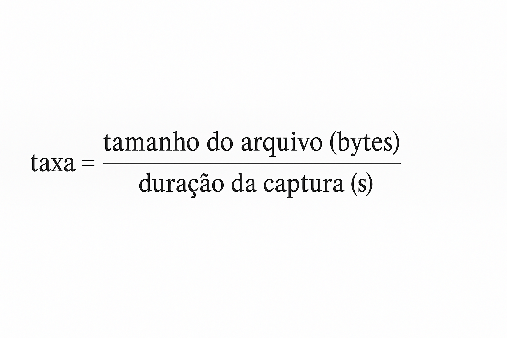

# 🛰️ Simulação de Roteamento Dinâmico com Docker + FRRouting (OSPF & RIP)

Este projeto simula uma topologia de rede com múltiplos roteadores interconectados, utilizando o container `frrouting/frr` para aplicar os protocolos de roteamento dinâmico OSPF e RIP.

---

## 📦 Requisitos

- [Docker Desktop](https://www.docker.com/products/docker-desktop)
- (Opcional) Wireshark para análise dos arquivos `.pcap`
- (Opcional) Python 3 para execução dos scripts automáticos de captura

---

## 🌐 Topologia da Rede

A topologia está dividida em dois domínios:
- O lado esquerdo da imagem utiliza o protocolo **OSPF**
- O lado direito utiliza **RIP**
```text


                              REDE OSPF                                                            REDE RIP

router0 --(192.168.0.0/24)-- router1 --(192.168.1.0/24)-- router2      router4 --(192.168.5.0/24)-- router5 --(162.168.6.0/24)-- router6
                                |                                                                       | 
                        (192.168.2.0/24)                                                         (192.168.7.0/24)
                                |                                                                       |
                              router3                                                                router7
```

---

## 🚀 Como rodar o projeto

### 1. Clone o repositório

```bash
git clone https://github.com/cicerocalsing/Redes2-GrauA.git
cd Redes2-GrauA
```

### 2. Inicie os containers

Abra o terminal na pasta do projeto e rode:

```bash
docker-compose up -d
```

Os containers com os roteadores serão iniciados e as configurações da rede e dos protocolos de roteamento serão aplicadas automaticamente.

---

## 🛠️ Estrutura do Projeto

```text
├── docker-compose.yml
├── router0/
│   ├── frr.conf
│   └── daemons
├── router1/
│   ├── frr.conf
│   └── daemons
├── ...
├── capturar_pcaps.bat
├── capturar_simultaneo.py
├── capturar_taxa_protocolo_desktop.bat
├── instalar_tshark_apk.bat
├── testes_realizados.ipynb
├── funcoes_automatizadas.py
├── Métricas dos pacotes.xlsx
├── topologia.png
├── formula_taxa.png
└── README.md
```

---

## 📘 Descrição dos arquivos

- `docker-compose.yml`: define a criação das redes e containers dos roteadores
- `frr.conf`: configurações do protocolo de roteamento para cada roteador
- `daemons`: define quais protocolos o roteador irá ativar (ex: `ospfd`, `ripd`)
- `testes_realizados.ipynb`: notebook com os testes realizados e análise dos dados
- `funcoes_automatizadas.py`: biblioteca com funções de apoio aos testes
- `Métricas dos pacotes.xlsx`: resultados dos testes de volume de pacotes
- `capturar_pcaps.bat`: executa capturas sequenciais de pacotes por roteador
- `capturar_simultaneo.py`: faz a mesma captura de forma simultânea via Python
- `capturar_taxa_protocolo_desktop.bat`: executa uma captura de 1 minuto e calcula a taxa de transmissão
- `instalar_tshark_apk.bat`: instala o `tshark` automaticamente nos containers Alpine

---

## 📈 Cálculo da Taxa de Transmissão

Para estimar a taxa de transmissão dos protocolos de roteamento, foi utilizada a fórmula abaixo:



---

## 📋 Observações

- O script `capturar_pcaps.bat` executa 10 capturas de 30 segundos para cada roteador de forma sequencial. A execução completa leva cerca de 35 minutos.
- Para um teste mais rápido e em paralelo, utilize `capturar_simultaneo.py` (requer Python).
- Os arquivos `.pcap` são salvos na pasta `Capturas`.

---


